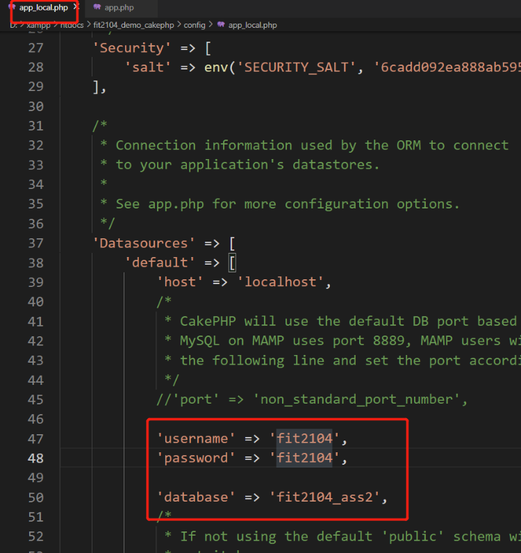
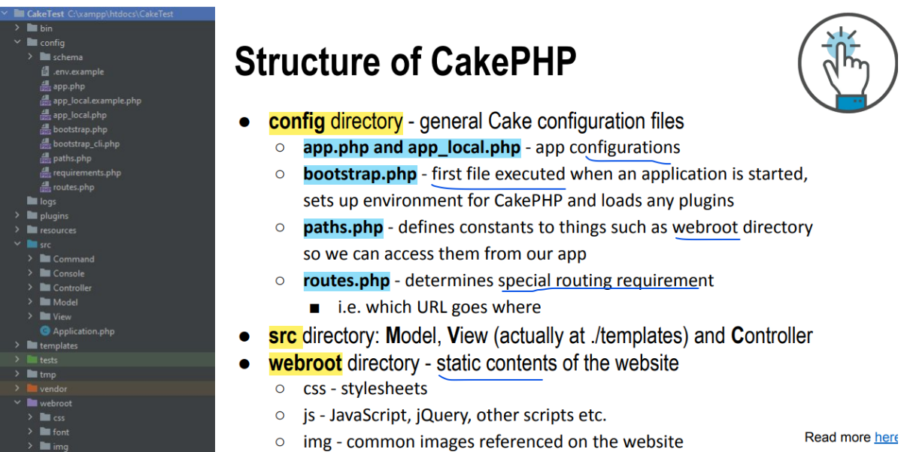

# Cakephp Notes

Author: Wei Liu

CakePHP Official Documentation：https://book.cakephp.org/5/en/index.html

## Introduction to CakePHP

1. widely used in the industry 
2. integrated CRUD for database interaction (built-in classes that do this) built-in validation capabilities 
3. built-in helpers for AJAX, JavaScript, HTML forms 
4. built-in components for emailing, cookies, security and sessions 
5. the use of MVC forces an OO approach rather than embedding PHP scripts in HTML, making app cleaner
6. If conventions are followed, CakePHP has the ability to create the table and use it (bake) automatically


## 2.Download Software

`Windows`

1. [phpStorm Download](https://www.jetbrains.com/phpstorm/promo/?source=google&medium=cpc&campaign=APAC_en_AU_PhpStorm_Branded&term=phpstorm&content=604024580601&gad_source=1&gclid=CjwKCAjw17qvBhBrEiwA1rU9w8G9JVwwkOkVLV7Tod3w58CbXEiAHl2V0qQPcpuXi2oYDtH0jhSWPhoC6wwQAvD_BwE) 
2. [xampp](https://www.apachefriends.org/)(suite including Apache,MySQL,PHP) 
3. In **php.init**, find "extension=intl", remove the semicolon in front of the line (if there is one) and save the file 
4. install Visual C 2017 runtime from Microsoft: https://support.microsoft.com/en-au/help/2977003/the-latest-supported-visual-c-downloads
5. Install Composer: https://getcomposer.org/


`Mac`

1. [phpStorm Download](https://www.jetbrains.com/phpstorm/promo/?source=google&medium=cpc&campaign=APAC_en_AU_PhpStorm_Branded&term=phpstorm&content=604024580601&gad_source=1&gclid=CjwKCAjw17qvBhBrEiwA1rU9w8G9JVwwkOkVLV7Tod3w58CbXEiAHl2V0qQPcpuXi2oYDtH0jhSWPhoC6wwQAvD_BwE)

2. Php and MySQL download: check the instruction video from Wei

3. Find **php.ini** file location in terminal

   ```bash
   php -i | grep php.ini
   ```

4. Open that file in VS code, find "extension=intl", remove the semicolon in front of the line (if there is one) and save the file:

5. Install Composer: https://getcomposer.org/


## 3.Download the Cakephp project

### 3.1 Download from Gitlab

for **developing** purpose

```bash
git clone <project url>
composer install
```


### 3.2 Download from local

For **learning** and testing purpose

1.Under the destination folder,open terminal

```bash
composer self-update && composer create-project cakephp/app <project_name>
# if Mac cannot run)add sudo before this command
```


2.log in the local database to create a user in the Terminal 

```mysql
mysql -uroot
show databases;
create user 'superuser'@'%' Identified by 'password';
Grant all privileges on *.* to 'superuser'@'%' with grant option;
flush privileges;
exit;
```

Test initial database: http://127.0.0.1:8080/phpmyadmin/


3.**app_local.php**: config database info connected to your local DB



Test initial website: http://localhost:8080/<project_name>


## 4.Project structure




## 5. Database **Conventions**

following them can make your life a lot easier

- Database table names are plural, e.g. customers, children (yes, the real plural in English) 
- Relationship table names are underscored, eg. categories_products and in alphabetical order  
- PK to be called id and be auto_increment 
- FK to be called a singular table name followed by _id, e.g. customer_id in the orders table 
- Attribute with two or more words are underscored, e.g. first_name


## 6.Bake the tables to generate codes

Aim of Baking: generate model, view,controller codes for us to make developing easier

Caution: **no need** bake the relationship table!!!


Under the root project directory

`Windows:`

```bash
bin\cake.bat bake all <table name>
```

`Mac:`

```bash
bin/cake bake all <table name>
```


