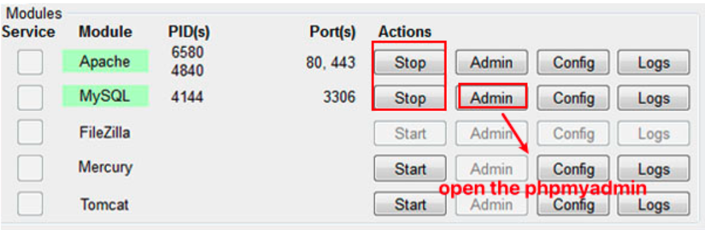
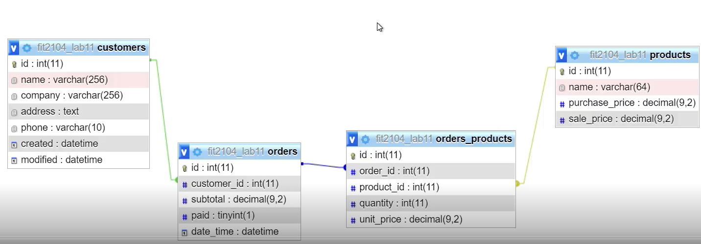
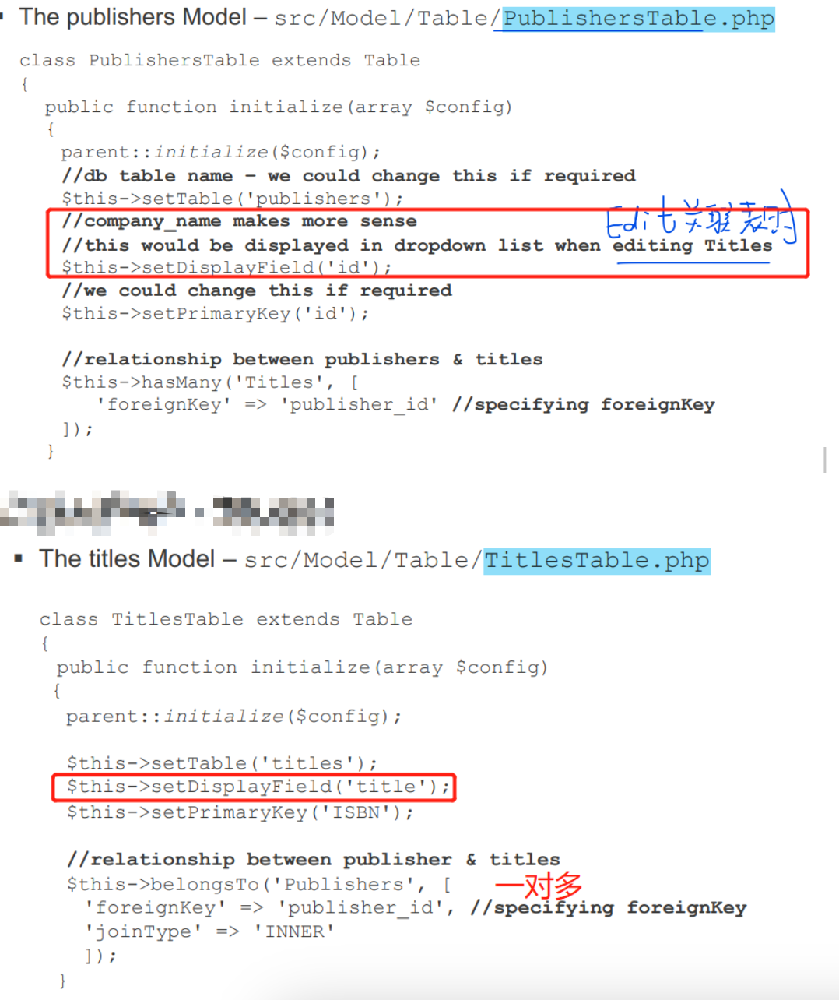
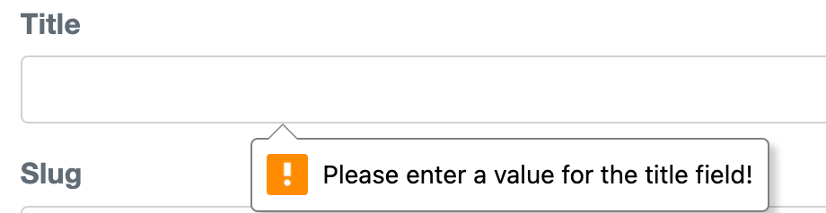
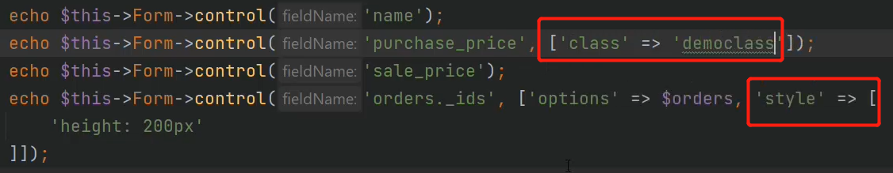
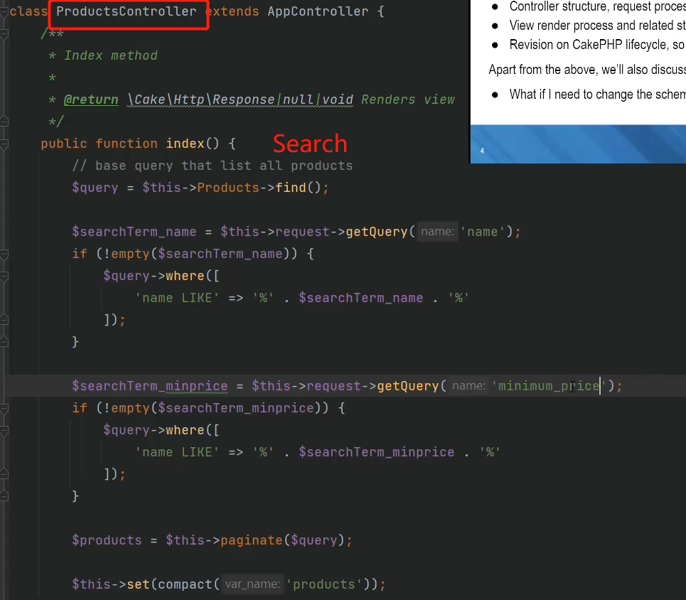
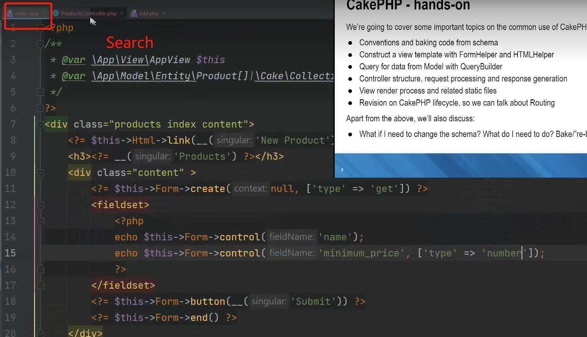
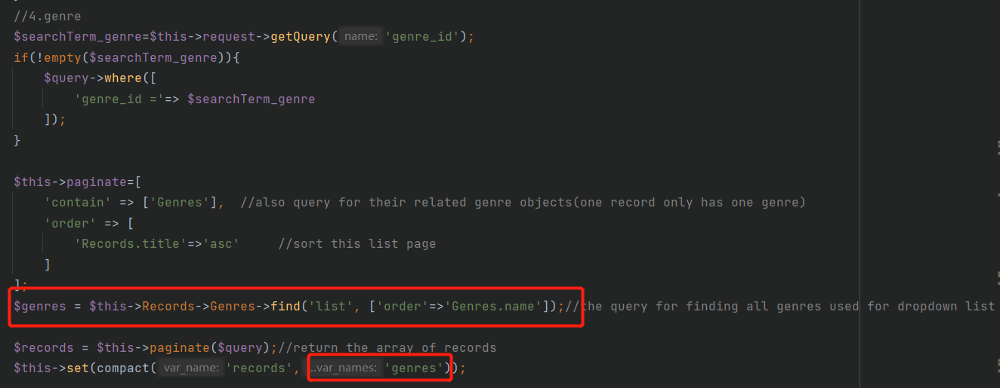
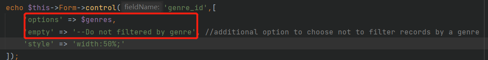

# Cakephp Notes

Author: Wei Liu

CakePHP Official Documentation：https://book.cakephp.org/5/en/index.html

## 1.Introduction to CakePHP

1. widely used in the industry 
2. integrated CRUD for database interaction (built-in classes that do this) built-in validation capabilities 
3. built-in helpers for AJAX, JavaScript, HTML forms 
4. built-in components for emailing, cookies, security and sessions 
5. the use of MVC forces an OO approach rather than embedding PHP scripts in HTML, making app cleaner
6. If conventions are followed, CakePHP has the ability to create the table and use it (bake) automatically


## 2.Download Software

`Windows`

1. [phpStorm Download](https://www.jetbrains.com/phpstorm/promo/?source=google&medium=cpc&campaign=APAC_en_AU_PhpStorm_Branded&term=phpstorm&content=604024580601&gad_source=1&gclid=CjwKCAjw17qvBhBrEiwA1rU9w8G9JVwwkOkVLV7Tod3w58CbXEiAHl2V0qQPcpuXi2oYDtH0jhSWPhoC6wwQAvD_BwE) 
2. [xampp](https://www.apachefriends.org/)(suite including Apache,MySQL,PHP) 
3. In **php.init**, find "extension=intl", remove the semicolon in front of the line (if there is one) and save the file 
4. install Visual C 2017 runtime from Microsoft: https://support.microsoft.com/en-au/help/2977003/the-latest-supported-visual-c-downloads
5. Install Composer: https://getcomposer.org/


`Mac`

1. [phpStorm Download](https://www.jetbrains.com/phpstorm/promo/?source=google&medium=cpc&campaign=APAC_en_AU_PhpStorm_Branded&term=phpstorm&content=604024580601&gad_source=1&gclid=CjwKCAjw17qvBhBrEiwA1rU9w8G9JVwwkOkVLV7Tod3w58CbXEiAHl2V0qQPcpuXi2oYDtH0jhSWPhoC6wwQAvD_BwE)

2. Php and MySQL download: check the instruction video from Wei

3. Find **php.ini** file location in terminal

   ```bash
   php -i | grep php.ini
   ```

4. Open that file in VS code, find "extension=intl", remove the semicolon in front of the line (if there is one) and save the file:

5. Install Composer: https://getcomposer.org/


## 3.Download the Cakephp project

(Mac)find and enter the **www** folder, open the terminal

(Windows)In xampp, find and enter the **htdocs** folder, open the terminal

### 3.1 Download from Github

For **developing** purpose

```bash
git clone https://github.com/wliu0025/phpreview.git
composer install
```

If first time, build new repository in github+ clone + build cakephp (same name)+ push


### 3.2 Download from local

For **learning** purpose, Create new Cakephp project

```bash
composer self-update && composer create-project cakephp/app <project_name>
# if Mac cannot run add sudo before this command
```


------

1.Start local server

(MAC)the server automatically runs once you download the environment

(Windows) Open xampp by clicking run as admin, start Apache and MySQL



>if cannot start,port issue,change the port 

https://stackoverflow.com/questions/18300377/how-to-solve-error-apache-shutdown-unexpectedly

>remove the process

https://stackoverflow.com/questions/39632667/how-do-i-remove-the-process-currently-using-a-port-on-localhost-in-windows


2.Enter the database

(Windows)Click “Admin” directly and enter the phpmyadmin

(Mac)log in the local database to create a user in the Terminal 

```mysql
mysql -uroot
show databases;
create user 'superuser'@'%' Identified by 'password';
Grant all privileges on *.* to 'superuser'@'%' with grant option;
flush privileges;
exit;
```

Test initial database: http://127.0.0.1:8080/phpmyadmin/


3.**app_local.php**: config database info connected to your local DB


Test initial website: http://localhost:8080/<project_name>


## 4.Project structure


## 5. Database **Conventions**

following them can make your life a lot easier

- Database table names are plural, e.g. customers, children (yes, the real plural in English) 
- Relationship table names are underscored, eg. categories_products and in alphabetical order  
- PK to be called id and be auto_increment 
- FK to be called a singular table name followed by _id, e.g. customer_id in the orders table 
- Attribute with two or more words are underscored, e.g. first_name

>例子1：customers, orders,products




## 6.Bake the tables to generate codes

Aim of Baking: generate model, view,controller codes for us to make developing easier

Caution: **no need** bake the relationship table!!!


Under the root project directory

`Windows:`

```bash
bin\cake.bat bake all <table name>
```

`Mac:`

```bash
bin/cake bake all <table name>
```


> Change the schema,re-bake?

Bake is about code generator(model+view+controller). If you're just adding new columns in the database tables, re-bake might not be a good idea as it will **overwrite** whatever files it generates. That includes all of your changes to the code. You can simply study all of the generated files and add the missing columns accordingly.

Usually this involves the following changes:	

- Model (both entity and tables, as it defines how entities behaves in CakePHP)	
- View templates (as it contains the actual HTML forms that might need new fields)	

- Clear the database/schema cache from /tmp/cache as CakePHP caches database schema for better performance. Old cache will result in new columns being ignored when ORM is making queries

However if you know what you're doing and only re-baking some modules (for example, only controllers, only views or only model files) then re-bake can be a time saver. 


## 7.Deploy to aws

security 添加22 SSH远程登录端口

### 1.**EC2 instance:** bitnami lamp

https://www.youtube.com/watch?v=2ge0-YHAdlQ&ab_channel=TheKnowledgeKitten

https://www.youtube.com/watch?v=MDl5lSJWBg8&ab_channel=TheKnowledgeKitten


**SSH:** 

```
ssh  -i "key3.pem" bitnami@13.211.137.41
```


**Db:**

```
ssh -N -L 8888:127.0.0.1:80 -i "key3.pem" bitnami@13.211.137.41
```

*http://127.0.0.1:8888/phpmyadmin*

root

Pwd: 29Lo/Py/+@If

```mysql
# create datbase
create database edupioneer;
```


## 8.Config 

### 1.app.php

Locale-sensitive: 设置当地时间

```php
'defaultLocale' => env('APP_DEFAULT_LOCALE', 'en_Au'),
'defaultTimezone' => env('APP_DEFAULT_TIMEZONE', 'Australia/Melbourne'),
```


### 2.app_local.php

set up database


### 3.bootstrap.php

first file executed to set up environment + plugin


### 4.paths.php

define constants常量


### 5.routes.php

Define which url goes where

```php
$builder->connect('/', ['controller' => 'Bookings', 'action' => 'choose']);
```


## 9.Model

### 1.Entity

作用：Entities represent a single record in the database. Define fields in the table + indivi functions

位置：像**src/Model/Entity/Article.php**


`自定义想显示的字段`

2 options

1. Change the index view

   ```php
   <td><?= h($publisher->first_name . ' ' . $publisher->last_name ) ?></td>
   ```

2. Virtual Fields： Create a function in Entity/Publisher.php

   ```php
   protected function _getFullName(){
     return $this->first_name . ' ' . $this->last_name;
   }
   ```

   in View

   ```php
   <td><?= h($publisher->full_name) ?></td>
   ```

   


### 2.Table

作用：provide access to the collection of entities stored in a table. Handles the definition of association, use of behaviors and verification of entities.

位置：像**src/Model/Table/ArticlesTable.php**


`Define some rules and associations`




`Validations`

```php
$validator
   ->scalar('title')
   ->maxLength('title', 255)
   // title presence is required when addred a record
   ->requirePresence('title', 'create')
   ->notEmptyString('title','Please enter a value for the title field!');
```

Turn off broswer default validation (This field cannot be left empty)

```php
 echo $this->Form->control('title',['novalidate'=>True]);
```




## 10.Controller

作用：handle HTTP requests and execute business logic contained in model methods, to prepare the response


>cake_cms例子
>
>user -> many articles
>
>many Articles <-> many tags

`得到对应的FK相关的数据(1个acticle对应的user)`

```php
$query = $this->Articles->find()->contain(['Users']);
$articles = $this->paginate($query);
```

```php
$article->user->email
```


`得到包含的多个数据(1个article有多个tags)`

```php
$article = $this->Articles->get($id, contain: ['Users', 'Tags']);
```

```php+HTML
$article->user->email
  
<?php foreach ($article->tags as $tag) : ?>
<tr>
  <td><?= h($tag->id) ?></td>
  <td><?= h($tag->title) ?></td>
  <td><?= h($tag->created) ?></td>
  <td><?= h($tag->modified) ?></td>
</tr>
<?php endforeach; ?>
```


`如果想单独提取这1个article的所有的tags对象并传到view上(view页面)`

```php
$tags=$this->Articles->Tags -> find('list',['order'=>'Tags.title']);
```


`独立fetch一个表的数据`

controller

```php
$allAvailabilities = $this->fetchTable('Availabilities')->find('all', [
  'order' => 'Availabilities.booked_time ASC'
])->all();


# 计算total number of clients
$client_query = $this->fetchTable('Clients')->find();
$client_counts = $client_query->all()->count();
```


`Edit改外键时,dropdown list显示排序的外键名字`

articles/edit.php

问题：we don't want to display the id  in the drop down list

```php
echo $this->Form->control('user_id', ['options' => $users]);
```

解决：

1. UsersTable.php

```php
 $this->setDisplayField('email');
```

2. controller/edit

```php
// 单独传外键的所有对象，为了view上dropdown显示所有
$publishers=$this->Titles->Publishers->find('list',['limit'=>200,'order'=>'Publishers.company_name'])
```


>换layout

Controller

```php
//You can use this method to perform logic that needs to happen before each controller action.
public function beforeFilter(\Cake\Event\EventInterface $event)
{
  parent::beforeFilter($event);

  $this->viewBuilder()->setLayout('adminManageLayout');
}
```


> Disable default layout

何时：return data in formats such as JSON or XML, or when you're building AJAX responses that do not require the HTML structure provided by a layout.

方法1: controller

```php
$this->viewBuilder()->setLayout(false);
```

方法2: View

```php
$this->disableAutoLayout();
```


## 11.Home + Default共享组件

1. **Home page**: src/Template/Pages/home.php + PagesController.php

2. 静态页面(**abutus,contactus**):  /Pages/aboutus 

3. **Default**: src/Template/Layout/default.php

   It is the ==template== for how our site is presented. We will include header/menu/footer that will appear on every page

   ```php+HTML
   <?php
   $cakeDescription = 'PHPReview: review the cakephp';
   ?>
   <!DOCTYPE html>
   <html>
   <head>
       <?= $this->Html->charset() ?>
       <meta name="viewport" content="width=device-width, initial-scale=1">
       <title>
           <?= $cakeDescription ?>:
           <?= $this->fetch('title') ?>
       </title>
     
     	<!-- webroot/favicon.ico -->
       <?= $this->Html->meta('icon') ?>
   
     	<!-- import css files -->
       <?= $this->Html->css(['normalize.min', 'milligram.min', 'fonts', 'cake']) ?>
   
       <?= $this->fetch('meta') ?>
       <?= $this->fetch('css') ?>
       <?= $this->fetch('script') ?>
   </head>
   <body>
       <nav class="top-nav">
           <div class="top-nav-title">
             <!-- /phpreview/ -->
               <a href="<?= $this->Url->build('/') ?>"><span>Cake</span>PHP</a>
           </div>
           
       </nav>
       <main class="main">
           <div class="container">
               <?= $this->Flash->render() ?>
               <?= $this->fetch('content') ?>
           </div>
       </main>
       <footer>
       </footer>
   </body>
   </html>
   ```

   

## 12.View

`view: h()`

```php+HTML
echo h("<h1>This is about us page</h1>");
echo "<h1>This is about us page</h1>"
```

h() is used as plain text, rather than being executed as code


`view: var_dump() and dump()`

var_dump() is for checking arrays and objects


`导入图片`

```php
<?php echo $this->Html->image('/img/cake-logo.png') ?>
```


`Form添加class样式`




>Get request: search by name






>Get request: show a dropdown list and search for one

Controller:

```php
$query=$this->Records->find();
```



View:


